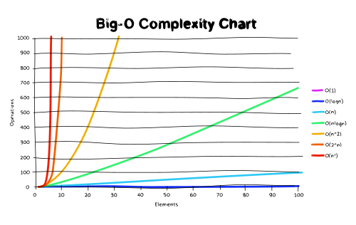

Big-O Notation
==============

Classes of functions that are commonly encountered when analyzing the running time of an algorithm.

<table style="width:98%;"><colgroup><col style="width: 14%" /><col style="width: 18%" /><col style="width: 66%" /></colgroup><thead><tr class="header"><th>Notation</th><th>Name</th><th>Example</th></tr></thead><tbody><tr class="odd"><td><strong>O(1)</strong></td><td><strong>constant</strong></td><td>running a statement, value look-up on an array, object, variable</td></tr><tr class="even"><td>O(log log n)</td><td>double logarithmic</td><td></td></tr><tr class="odd"><td><strong>O(log n)</strong></td><td><strong>logarithmic</strong></td><td>loop that cuts the problem in half every iteration</td></tr><tr class="even"><td>O((log n)^c)</td><td>polylogarithmic</td><td></td></tr><tr class="odd"><td>O(n^c)</td><td>fractional power</td><td></td></tr><tr class="even"><td><strong>O(n)</strong></td><td><strong>linear</strong></td><td>looping through the values of an array</td></tr><tr class="odd"><td>O(n log* n)</td><td>n log-star n</td><td></td></tr><tr class="even"><td><strong>O(n log n)</strong></td><td><strong>quasilinear</strong></td><td>recursion with binary split (merge sort), heap sort</td></tr><tr class="odd"><td><strong>O(n^2)</strong></td><td><strong>quadratic</strong></td><td>double nested loops, bubble sort, selection sort, insertion sort</td></tr><tr class="even"><td>O(n^c)</td><td>polynomial</td><td></td></tr><tr class="odd"><td>O(c^n)</td><td>exponential</td><td>TSP (dynamic programming)</td></tr><tr class="even"><td>O(n!)</td><td>factorial</td><td>TSP (brute force)</td></tr></tbody></table>
